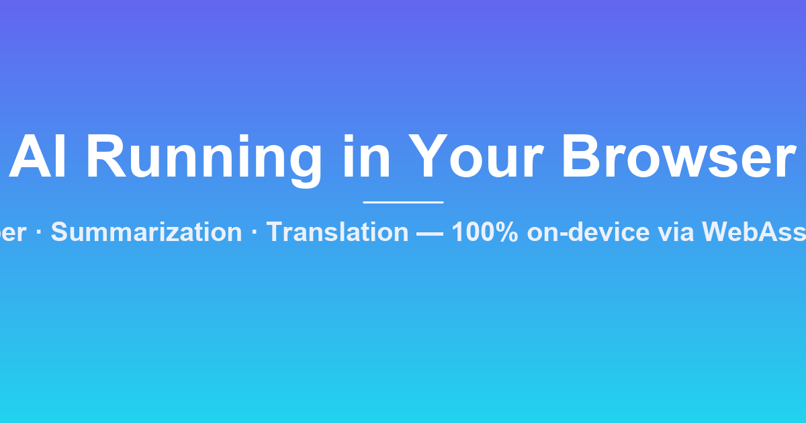

<div align="center">

# 🧠 AI Running in Your Browser

**Real Whisper · Summarization · Translation — 100 % on-device via WebAssembly**

Zero backend · Zero API keys · Nothing ever leaves your device

[**🚀 Live demo**](https://novrekdevelop.github.io/airunningyourbrowser/) · [**Install as a PWA**](#-install-as-an-app)
· [**Report a bug**](https://github.com/novrekdevelop/airunningyourbrowser/issues)


</div>



---

## 🔍 What is this?

A working demo where **real AI models run entirely inside your browser** —
compiled to WebAssembly via **ONNX Runtime Web** (wrapped by 🤗
**Transformers.js**). No backend, no API keys, no server-side inference, and
**no data ever leaves your device**.

It does three things, each of which can be tried with one click:

| 🎤 Speech → Text | Record or upload audio → get a transcript | `Xenova/whisper-*` |
| 📝 Text → Summary | Paste a long article → get a short summary | `Xenova/t5-small` / `distilbart-cnn` |
| 🌐 Text → Translate | Translate between EN · ES · FR · DE · IT | `Xenova/opus-mt-*` |

---

## ✨ Table of contents

- [Why it stands out](#-why-it-stands-out)
- [How it works](#-how-it-works)
- [Run it locally](#-run-it-locally)
- [Install as an app](#-install-as-an-app)
- [Deploy to GitHub Pages](#-deploy-to-github-pages)
- [Privacy & data](#-privacy--data)
- [Trade-offs (said out loud)](#-trade-offs-said-out-loud)
- [Going further](#-going-further)
- [Tech stack](#-tech-stack)
- [Files](#-files)
- [Contributing](#-contributing)
- [License](#-license)

---

## 🌟 Why it stands out

- **🔒 Private by default** — audio and text are processed in memory on your device,
  never uploaded, never stored, never sent to a server.
- **💰 Free forever** — no servers, no per-request fees, no rate limits.
- **⚡ Frictionless** — a link is enough: one click to try it, no account, no token,
  no installation.
- **📱 Installable (PWA)** — works offline after the first model download and can be
  installed like a native app.
- **🌍 Multilingual** — Whisper auto-detects the spoken language, and offline
  translation covers EN ↔ ES · FR · DE · IT.

## 🔧 How it works

1. `index.html` + `app.js` load 🤗 Transformers.js from a CDN (vanilla ES module,
   **no build step**).
2. The first time you run a task, Transformers.js downloads the model from the
   Hugging Face Hub as **ONNX weights quantized to 8-bit** and caches them in your
   browser.
3. **ONNX Runtime Web** executes the model as **WebAssembly** on your CPU. Enable the
   **⚡ WebGPU** switch in the app to run on your graphics card instead — several
   times faster on supported devices.
4. After that first load, the app works **fully offline** — inference never touches a
   server.

```
browser ──┬── service worker   (app shell cached → works offline)
          ├── transformers.js  (imported once from CDN, then cached)
          └── ONNX model       (downloaded once per model, cached by browser)
                 │
                 ▼
         WebAssembly / WebGPU (runs on YOUR device)
```

## 🚀 Run it locally

> Any static file server works — no build step, zero runtime dependencies. Python is
> recommended (and included in the launchers).

### 🖱️ The easy way — double-click

| Your OS | Do this |
|---|---|
| **Windows** | Double-click **`start.bat`** |
| **macOS / Linux** | Double-click **`start.sh`** (or run `./start.sh` in a terminal) |

The launcher picks a free port, starts the server and opens the app in your
default browser automatically. Close the window (Windows) or press `Ctrl+C`
(macOS/Linux) to stop.

### ⌨️ The manual way

```bash
# Option 1 — Python (no dependencies)
python start.py                      # → http://127.0.0.1:8000
python server.py --port 9000         # the classic server, same thing

# Option 2 — Node (any static server)
npx serve .
```

Open **http://127.0.0.1:8000**, click the microphone 🎤 and talk — or open the
**📝 Text → Summary** / **🌐 Text → Translate** tabs and hit the sample buttons.

> **Notes**
> - Internet is needed **only** for the first per-model download; afterward models run
>   offline from the browser cache.
> - The microphone requires a **secure context** (`https://` or `http://localhost`).
>   The bundled `start.py`/`server.py` provide it; on any other host, file-upload
>   transcription still works everywhere.
> - **No Python?** Any static server works: `npx serve .` (Node), or the built-in
>   servers of VS Code / JetBrains IDEs.

---

## 💱 Install as an app

Because this repo ships a PWA manifest + service worker, your browser offers to
install the app:

- **Chrome / Edge** — use the install icon in the address bar (or ⋮ → *Install app*).
- **iOS Safari** — Share → *Add to Home Screen*.

After that it opens in its own window and works offline.

## 🌐 Deploy to GitHub Pages

A ready-made workflow (`.github/workflows/deploy.yml`) deploys the app to GitHub
Pages automatically on every push:

1. Push this repo to GitHub (branch `main`).
2. **Settings → Pages** → Source: **GitHub Actions**.
3. Push a new commit — the site goes live.
4. The **Open Graph** meta tags in `index.html` already point to this live site,
   so shared links render a pretty card on X / LinkedIn / WhatsApp.

## 🔒 Privacy & data

This is a **zero-telemetry** app:

- Audio is decoded **only in memory**, transcribed on-device, then discarded —
  nothing is uploaded.
- Pasted text is processed locally; it is never transmitted.
- The only network requests are the pinned CDN library and model-weight downloads
  (HTTPS). No analytics, no cookies, no accounts.
- Please keep it that way in your contributions. 🙏

## ⚖️ Trade-offs (said out loud)

- Models must be **small**: distilled/quantized weights only (hence tiny/base).
- The first visit pays a **one-time download cost** per model.
- CPU-only WASM is slower than GPU inference — use the WebGPU toggle or see
  **Going further** below.

## 🔮 Going further

- **WebGPU**: run the same ONNX graphs on your GPU with Transformers.js
  (`device: "webgpu"`) for a several-fold speed-up. The app's toggle already
  does this and falls back to CPU on unsupported devices.
- **Cross-origin isolation** (`COOP`/`COEP`, already in `server.py`) unlocks
  `SharedArrayBuffer` → **multithreaded WASM**, dramatically faster on multi-core
  CPUs.
- **Other models**: this pattern generalizes — image classification, object
  detection, an offline LLM via `llama.cpp`-compiled WASM / Transformers.js, etc.
- **Offline-first**: download the ONNX weights and serve them from your own origin
  for a fully self-hosted, air-gapped deployment.

## 🧰 Tech stack

| Layer | Technology |
|---|---|
| Models | OpenAI Whisper · Google T5 · BART (distilbart) · Helsinki-NLP OPUS-MT |
| Inference engine | ONNX Runtime Web (WASM / WebGPU) |
| Wrapper | 🤗 Transformers.js |
| Frontend | Vanilla ES modules — no build step, no framework |

## 📁 Files

| File | Purpose |
|---|---|
| `start.bat` | **Windows** double-click launcher |
| `start.sh` | **macOS / Linux** double-click launcher |
| `start.py` | Cross-platform launcher that both scripts call (auto-opens browser) |
| `index.html` | UI (tabs, controls, outputs, SEO + PWA meta) |
| `styles.css` | Styling |
| `app.js` | All inference logic: pipelines, progress, mic/upload, summarization, translation |
| `server.py` | Zero-dependency static server (COOP/COEP headers, CLI flags) |
| `sw.js` | Service worker (offline shell, installable) |
| `manifest.webmanifest` | PWA manifest |
| `icons/` | Generated app icons + 1200×630 social share card |
| `scripts/generate_icons.py` | Regenerates `icons/` (needs Pillow) |
| `.github/workflows/deploy.yml` | Auto-deploy to GitHub Pages |

## 🤝 Contributing

Contributions are welcome! Please read
[`CONTRIBUTING.md`](CONTRIBUTING.md) first, and report security issues via
[`SECURITY.md`](SECURITY.md).

- ⭐ Star the repo if it's useful — it genuinely helps.
- 🐛 Report bugs with browser/OS versions and any console output.
- 🌐 Add language pairs or new tasks via a pull request.

## 📄 License

MIT — see [`LICENSE`](LICENSE). Models retain their own licenses (Apache-2.0 /
MIT, as marked on the Hugging Face Hub).